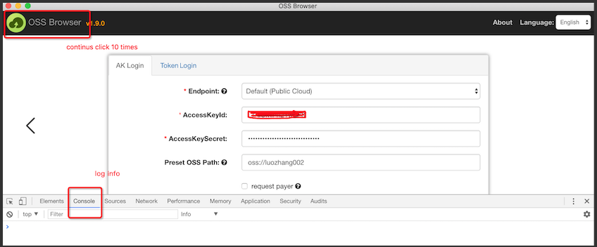
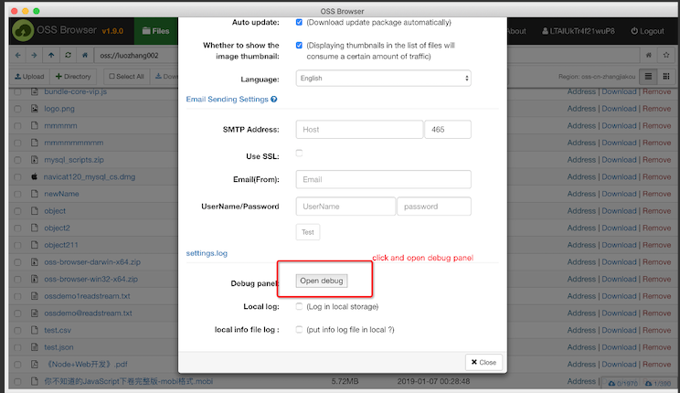

# Quick start

wosbrowser is a graphical management tool developed by Alibaba Cloud. It provides features similar to those of Windows Explorer. Using wosbrowser, you can view, upload, download, and manage objects with ease.

## [README of Chinese](https://github.com/Wangsu-Cloud-Storage/wos-browser/blob/master/README-CN.md)

## Platform

Windows7 above, Linux and Mac. We do not recommend using WindowsXP and WindowServer

## Procedure

1.  Download and install wosbrowser.

    |Supported platform|Download link|
    |:-----------------|:------------|
    |Window x32|[Window x32](https://github.com/Wangsu-Cloud-Storage/wos-browser/blob/master/all-releases.md)|
    |Window x64|[Window x64](https://github.com/Wangsu-Cloud-Storage/wos-browser/blob/master/all-releases.md)|
    |MAC|[MAC](https://github.com/Wangsu-Cloud-Storage/wos-browser/blob/master/all-releases.md)|
    |Linux x64|[Linux x64](https://github.com/Wangsu-Cloud-Storage/wos-browser/blob/master/all-releases.md)|

2.  Start and log on to wosbrowser.
3.  Manage buckets. You can create a bucket, delete a bucket, modify the ACL for a bucket, and manage the fragments in a bucket.
4.  Manage objects. You can upload \(resumable\), download \(resumable\), delete, copy, move, rename, search for, and preview an object, and modify the ACL or set an HTTP header for an object.

## Debug

If you encounter any problems during using wosbrowser, you can open the debug mode and observe the console panel. How to open
the debug mode,you can click the left icon ten times ,after 1.8.0 version you also open debug mode in settings pages

## Qr code
1. WosBrowser answering questions

2. Group number:21985509

## Links
[wosbrowser](https://www.alibabacloud.com/help/doc-detail/61872.htm)

## LICENSE

[Apache License 2.0](LICENSE)
