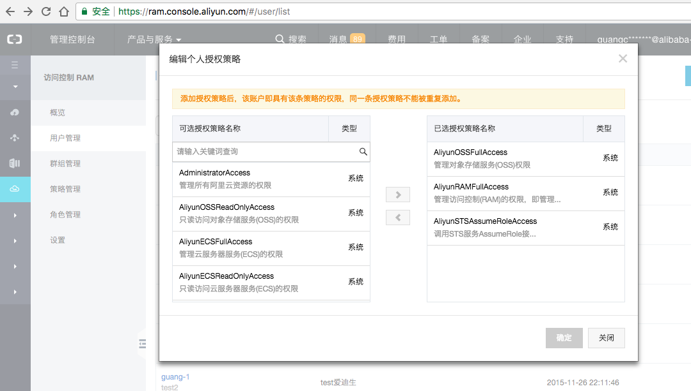
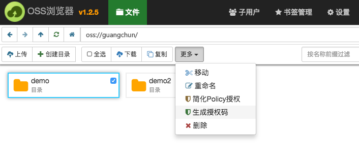
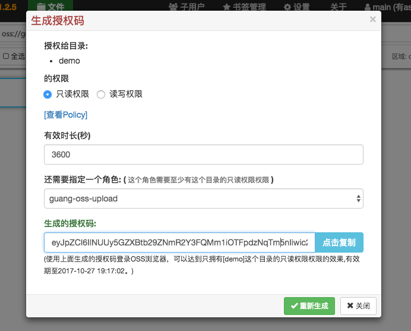

# Authorization code support


## 1. STS Token encoding

Obtain an authorization code by using the on-demand authorization function of Alibaba Cloud Security Token Service (STS).

Log on to the WOS browser by using the authorization code.

For details, visit https://help.aliyun.com/document_detail/31935.html

### (1) Create a role

Create a role in accordance with the instructions described in [STS On-demand Access Authorization](https://help.aliyun.com/document_detail/31935.html).

### (2) Generate an authorization code in the WOS browser

* Log on using the Access Key of a subaccount rather than the primary account.

* The subaccount must be assigned the "AliyunSTSAssumeRoleAccess" and "AliyunRAMReadOnlyAccess" permissions and the permission to access the directory to be authorized.

Subaccount authorization (recommended configuration for novice users):




Authorization in the WOS browser:







### (3) Logon using the authorization code:


### (4) Authorization code format

The authorization code generated by a program must adopt the following format:

```javascript
var opt = {
  id: '',
  secret: '',
  stoken: '',
  privilege: '',
  expiration: '',
  wospath: ''
};

//toString
opt = JSON.stringify(opt);

//base64 encode
Buffer.from(opt).toString('base64');
```

For details, see the following code: [app/main/files/modals/grant-token-modal.js](app/main/files/modals/grant-token-modal.js).


## 2. Sub user AK encoding

Generated by a program must adopt the following format:

```javascript
var opt = {
  id: '',
  secret: '',
  desc: '',
  region: 'wos-cn-shenzhen',
  wospath: 'wos://your-bucket/test/',  
  eptpl: 'http://{region}.aliyuncs.com'
};

//toString
opt = JSON.stringify(opt);

//base64 encode
Buffer.from(opt).toString('base64');
```
